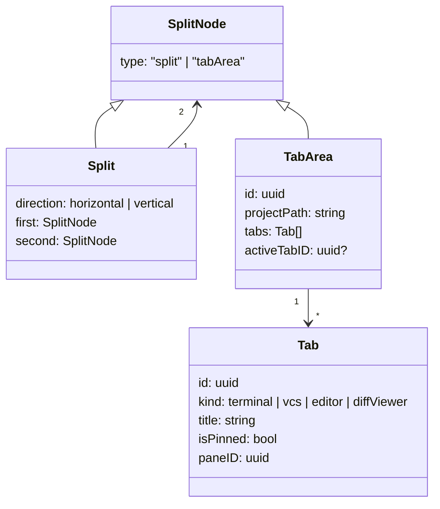

# Data Objects

## Project

```json
{
  "id": "uuid",
  "name": "muxy",
  "path": "/Users/example/project",
  "sortOrder": 0,
  "createdAt": "2026-04-19T10:00:00Z",
  "icon": "hammer",
  "logo": "custom",
  "iconColor": "#7C3AED"
}
```

## Worktree

```json
{
  "id": "uuid",
  "name": "main",
  "path": "/Users/example/project",
  "branch": "main",
  "isPrimary": true,
  "canBeRemoved": false,
  "createdAt": "2026-04-19T10:00:00Z"
}
```

## Workspace

A workspace contains:

- `projectID`
- `worktreeID`
- `focusedAreaID`
- `root` — recursive tree node

`root` has two node types:



`paneID` is required for terminal-related methods.

## Terminal attach

`attachPane` returns the state needed to start rendering a pane:

```json
{
  "paneID": "uuid",
  "cols": 120,
  "rows": 40,
  "baseOffset": 4096,
  "snapshot": "<base64-encoded raw VT bytes>"
}
```

- `cols` / `rows` are the host's terminal size. Render at this size and fit-to-width on screen.
- `snapshot` is a one-time paint of the current screen as raw VT bytes. Feed it into your emulator first; live `output` frames follow.
- `baseOffset` is the byte offset of the live stream as of the snapshot. Consume [`output` binary frames](protocol.md#terminal-binary-channel) whose `sequence` is at or after it, and track `nextExpectedOffset` for [`resyncPane`](methods.md#terminal).

## Terminal detached

```json
{ "paneID": "uuid" }
```

Sent as a `terminalDetached` event when an attached pane is closed on the Mac.

## Notification

| Field | Notes |
| --- | --- |
| `id` | UUID |
| `paneID` | Originating pane (if known) |
| `projectID` / `worktreeID` / `areaID` / `tabID` | Full navigation context for click-to-focus |
| `source` | `claude_hook`, `opencode`, OSC, custom, … |
| `title` / `body` | User-visible content |
| `timestamp` | ISO 8601 |
| `isRead` | bool |

## Project logo

Base64-encoded PNG:

```json
{ "projectID": "uuid", "pngData": "iVBORw0KGgoAAAANS..." }
```
