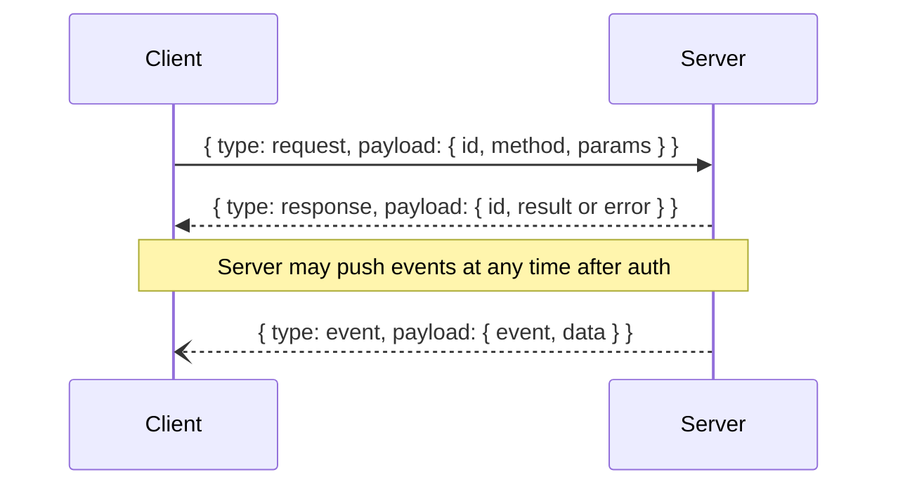

# Protocol

The connection carries two channels over one WebSocket, distinguished by frame opcode:

- **Text frames** are JSON control messages (`request` / `response` / `event`). Everything except live terminal I/O uses this channel.
- **Binary frames** are compact terminal frames carrying the raw PTY byte stream and keyboard input. This is the high-frequency path; it is never JSON-wrapped. See [Terminal binary channel](#terminal-binary-channel).

Every text frame is a JSON object with a top-level `type` field. Three types: `request`, `response`, `event`.



## Request envelope

```json
{
  "type": "request",
  "payload": {
    "id": "request-id",
    "method": "listProjects",
    "params": null
  }
}
```

Rules:

- `id` is unique per in-flight request.
- `method` identifies the API operation.
- `params.type` must match `method` when params are present.
- Methods without parameters may send `params: null`.

Example with params:

```json
{
  "id": "req-1",
  "method": "getWorkspace",
  "params": {
    "type": "getWorkspace",
    "value": {
      "projectID": "9b84c9a0-1d55-4c64-bbf6-ef59ee02fa09"
    }
  }
}
```

## Response envelope

Success:

```json
{
  "type": "response",
  "payload": {
    "id": "request-id",
    "result": { "type": "ok" }
  }
}
```

Failure:

```json
{
  "type": "response",
  "payload": {
    "id": "request-id",
    "error": { "code": 401, "message": "Authentication required" }
  }
}
```

Only one of `result` or `error` is present; the unused field is omitted.

## Event envelope

```json
{
  "type": "event",
  "payload": {
    "event": "workspaceChanged",
    "data": {
      "type": "workspace",
      "value": { "projectID": "…", "worktreeID": "…", "focusedAreaID": "…", "root": { "type": "tabArea", "tabArea": { … } } }
    }
  }
}
```

See [Events](events.md) for the full list of pushed events and their data types.

## Terminal binary channel

After a client attaches to a pane (see [`attachPane`](methods.md#terminal)), live terminal output, keyboard input, host resizes, and acks travel as **binary** WebSocket frames. Each frame is a fixed 30-byte header followed by a raw payload. All multi-byte integers are little-endian.

| Offset | Size | Field | Notes |
| --- | --- | --- | --- |
| 0 | 1 | `version` | Always `1` |
| 1 | 1 | `kind` | `1` output, `2` input, `3` resize, `4` ack |
| 2 | 16 | `paneID` | UUID bytes |
| 18 | 8 | `sequence` | Meaning depends on `kind` |
| 26 | 4 | `payloadLength` | Payload byte count (`N`) |
| 30 | N | `payload` | Raw bytes |

`sequence` per kind:

- **output** (server → client): byte offset of the **first** payload byte in this pane's lifetime stream. The payload is raw PTY bytes — feed them straight into your VT emulator. Track `nextExpectedOffset = sequence + payloadLength`; that value is what you send to [`resyncPane`](methods.md#terminal) after a reconnect.
- **input** (client → server): unused (send `0`). The payload is raw bytes delivered verbatim to the PTY — encode keystrokes, escape sequences, control codes, and mouse reports yourself.
- **resize** (server → client only): the host's terminal size, packed as `(cols << 32) | rows`; `payloadLength` is `0`. The host owns the size; clients never send resize frames. Render at the host's `cols`×`rows` and fit-to-width on screen.
- **ack** (client → server, optional): the highest contiguous offset you have rendered. Accepted and reserved for replay-buffer management; the current host does not yet act on it, and a minimal client can skip it.

A chunk has no guarantee of ending on a UTF-8 or escape-sequence boundary; the emulator must buffer partial sequences across frames. Because the host streams the exact continuous byte stream, replaying from any `nextExpectedOffset` reproduces precisely the bytes a still-connected client would have received.
